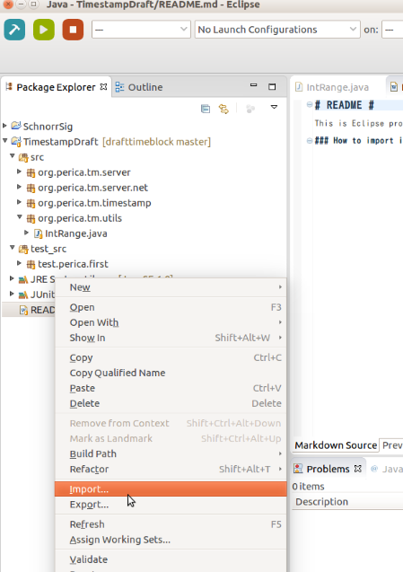
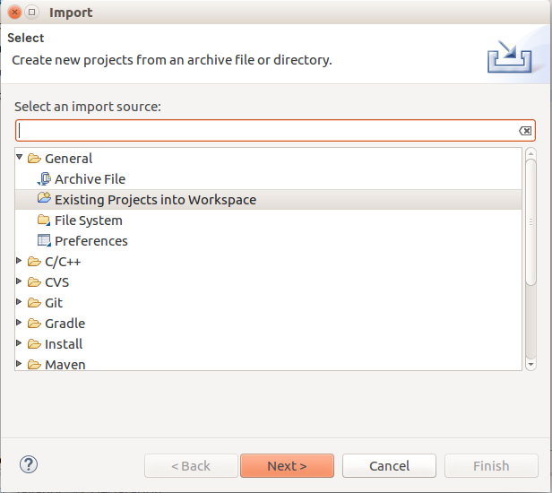
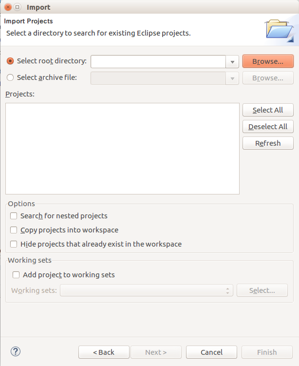

# README #

This is Eclipse project, you can import this directory as Eclipse project.

### Checkout source code ###

Execute following command.

`git clone https://github.com/alinous-core/codablecash.git`

### How to import into Eclipse workspace? ###

Click right mouse button on Package Explorer, and select "Import".

Select "Existing Projects Into Workspace" from "General" category. And push Next button.

Push "Browse..." button next to the "Select root directory" option, and select directory you cloned this project.

Push "Finish" button, then the directory is imported into Eclipse workspace as Java Project.