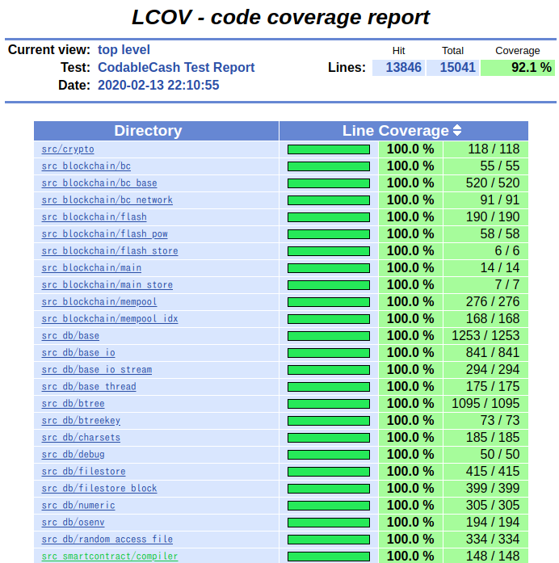

# Build & Testing Shell Scripts

This folder contains shell script to build and test codablecash.

## Please execute from parent Directory

Shells in this folder are designed to be executed from parent folder.

i.e. Executing test script.

`~/ram/codablecash$ ./sh/maketest.sh` 

(In this example, I'm using ram directory, and the location is "~/ram/")

## Build Codablecash in Debug Target

In order to build Codablecash, execute following Shell script.

### 1. Execute Cmake

Build tool of Codablecash's source code is Cmake, therefore please install Cmake at first.

After that, execute following shell script from root(parent of here) directry of Codablecash.

`~/ram/codablecash$ ./sh/cmakeDebug.sh ` 

### 2. Build & Test

After executing Cmake, exectute following Shell script.

`~/ram/codablecash$ ./sh/maketest.sh` 

### Output of Test

By executing test, coverage report is generated in the "codablecash/target/html_report/".

 
